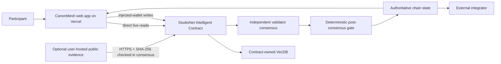
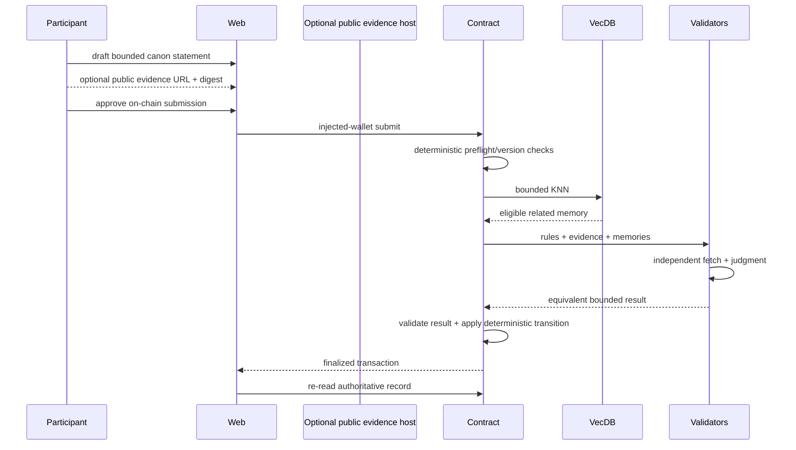

# CanonMesh — Architecture

## 1. Architectural thesis

CanonMesh is a production system for teams that create a large fictional world across scripts, quests, episodes, character notes and lore documents. Drafting and collaboration stay off-chain. GenLayer is used only when an editor wants a bounded statement to become part of the canonical universe. The contract remembers accepted canon semantically, retrieves the small set of prior facts most likely to conflict, and lets validators classify the new entry as compatible, intentional retcon, branch-only material, or unresolved conflict.

The architecture preserves one boundary:

> High-volume creation/observation happens off-chain; **the canonical state of a fictional universe: which bounded facts belong to which version/branch and which earlier facts they supersede** becomes authoritative only after a bounded GenLayer flow.

## 2. System context



There is no project backend, application database, custom indexer or separately hosted service. The contract is the application source of truth.

## 3. Components

### Web application

- domain workflow;
- public browsing;
- injected wallet;
- artifact preparation;
- live contract reads;
- transaction/finality rail;
- semantic-memory display;
- authoritative decision/history pages.

### Browser authoring and optional public evidence

Drafting is intentionally outside CanonMesh's canonical state until the editor submits a bounded proposal. The frontend may hold a form draft in browser memory; writers may also work in their normal external tools. CanonMesh does not persist drafts in a project database.

A proposal can optionally reference an independently hosted public HTTPS artifact. The submitter must provide its SHA-256 digest. Validators fetch and verify that same artifact during consensus. If it cannot be verified, the contract fails closed to an insufficient/unavailable outcome.

### Intelligent Contract

World charter hash; branches; accepted canon entries; proposal lifecycle; supersession links; semantic vector pointers; consensus classification; version counters; immutable decision receipts.

### Contract-owned semantic memory

Embed each accepted canon entry using a normalized string containing world, branch, entity names, time anchors, location, claim type and bounded canon statement. A proposal embeds the same normalized shape and retrieves at most 8 nearest accepted entries within the same world/branch. Similarity only selects context; it never proves compatibility or conflict.

## 4. Data ownership

| Data | Source of truth | Mutable | Consensus input |
|---|---|---:|---:|
| Draft/high-volume work | User tools / ephemeral browser form | Yes, until submitted | No |
| Optional public artifact | Independent public host + digest bound in contract | External | Yes, if supplied |
| Rules/charter/rubric version | Contract | Versioned | Yes |
| VecDB pointer/vector | Contract | Append by invariant | Yes, bounded retrieval |
| Final status/receipt | Contract | Terminal/versioned | N/A; output |
| UI presentation state | Browser memory | Yes | Never authoritative |
| Deployment facts | Repository docs + explorer/chain | Append | N/A |

## 5. Domain contract model

- World { steward, name, charter_url, charter_digest, version, branch_count, entry_count }
- Branch { world_id, parent_branch_id, name, version, active }
- CanonEntry { world_id, branch_id, proposal_id, title, statement, artifact_url, artifact_digest, entity_keys_json, time_anchor, accepted_at, superseded_by, overrides_json }
- Proposal { proposer, world_id, branch_id, mode, title, statement, artifact_url, digest, entity_keys_json, time_anchor, status, related_ids_json, supersedes_json, branch_overrides_json, rationale, submitted_at, reviewed_at }
- VectorPointer { entry_id, world_id, branch_id }

## 6. Public contract surface

- create_world(name, charter_text, charter_url, charter_digest) -> world_id
- set_editor(world_id, editor_address, enabled)
- create_branch(world_id, branch_name, parent_branch_id) -> branch_id
- submit_proposal(world_id, branch_id, mode, title, canon_statement, artifact_url, artifact_digest, entity_keys, time_anchor) -> proposal_id
- review_proposal(proposal_id) -> decision receipt
- cancel_proposal(proposal_id)
- get_world(world_id)
- get_branch(branch_id)
- get_entry(entry_id)
- get_proposal(proposal_id)
- list_world_entries(world_id, branch_id, offset, limit)
- preview_related(proposal_id, k)

Third-party consumers must be able to reconstruct the final status from views alone.

## 7. End-to-end sequence



## 8. Semantic-memory path

Embedding inputs:

Embed each accepted canon entry using a normalized string containing world, branch, entity names, time anchors, location, claim type and bounded canon statement. A proposal embeds the same normalized shape and retrieves at most 8 nearest accepted entries within the same world/branch. Similarity only selects context; it never proves compatibility or conflict.

Decision prompt fields:

- world charter excerpt/hash
- proposal mode
- bounded canon statement
- entity keys
- time anchor
- artifact evidence excerpt
- branch ancestry
- retrieved canon entries with IDs and status

The architecture deliberately separates **selection** from **judgment**. A memory hit is never enough to authorize the final transition.

## 9. Direct frontend/contract boundary

There is no project API or service boundary.

```text
React page/component
  -> typed live data-source
  -> genlayer-js read client
  -> deployed CanonMesh contract
```

Writes use the same direct path with the connected injected wallet.

Optional evidence preparation is intentionally simple:

```text
user-owned public HTTPS artifact (optional)
  -> user computes/provides SHA-256 digest
  -> frontend validates URL/digest format
  -> proposal stores URL + digest on-chain
  -> validators independently fetch + hash during review
```

If an artifact is not required, the proposal's bounded canon statement and on-chain charter are enough to adjudicate. CanonMesh never needs to host files itself.

## 10. Route architecture

| Route | Domain screen | Primary action |
| --- | --- | --- |
| / | World desk | Open world or create world |
| /worlds/[worldId]/canon | Canon ledger | Inspect entry / propose addition |
| /worlds/[worldId]/entities/[entityKey] | Entity dossier | Open related canon |
| /worlds/[worldId]/timeline | Timeline strip | Filter by entity/location |
| /worlds/[worldId]/proposals/new | Proposal composer | Submit proposal |
| /proposals/[proposalId] | Conflict table | Run review / inspect decision |
| /worlds/[worldId]/branches | Branch map | Create branch |
| /receipts/[proposalId] | Decision receipt | Copy receipt / explorer |

The full layout rules are in `ui/ux.md`.

## 11. State transition principles

Status vocabulary:

```text
DRAFT_OFFCHAIN, SUBMITTED, UNDER_REVIEW, COMPATIBLE, RETCON_VALID, BRANCH_ONLY, CONFLICT, INSUFFICIENT_CONTEXT, CANCELLED
```

Implement an explicit transition table in code/tests. Do not infer allowed transitions from ordering above.

A final record is immutable. Corrections create an explicit version/supersession/new case.

## 12. Consensus boundary

Decision:

> Given the proposal, on-chain world charter, proposal mode and retrieved active canon entries, do validators agree on COMPATIBLE, RETCON_VALID, BRANCH_ONLY, CONFLICT, or INSUFFICIENT_CONTEXT? RETCON_VALID must agree on the exact active **same-branch** entry IDs superseded. BRANCH_ONLY must agree on the exact active **ancestor-branch** entry IDs shadowed only for that branch lineage. Validators compare decision-critical fields/IDs, not rationale prose.

### Before nondeterminism

- role/identity;
- record exists;
- state allows review;
- base version current;
- sizes/counts bounded;
- immutable evidence refs syntactically valid;
- required enumerations allowed.

### Inside nondeterminism

- independently fetch public evidence where needed;
- interpret semantic evidence;
- compare retrieved memories for applicability;
- return fixed enums/bands/IDs.

### After nondeterminism

- validate all returned IDs/enums;
- re-check base state;
- deterministic arithmetic/state changes;
- memory insertion;
- events/counters.

## 13. Security boundaries

### User/caller

Cannot make user-submitted prose authoritative external evidence by assertion.

### Public evidence

Potential prompt injection. Bound and frame as data. Unavailable evidence fails closed.

### Semantic memory

Public and fallible as precedent/context. Namespace/version filters are deterministic.

### Browser/front-end presentation

Can hold ephemeral form and view state; cannot author or override canonical contract state.

### Wallet

Actual provider account/network immediately before signature is authoritative.

### Runtime

Finalized transaction status alone is not success; GenVM execution must be inspected.

## 14. Failure semantics

| Failure | Result |
|---|---|
| Optional public evidence unavailable during review | insufficient/failure; no positive state |
| Evidence URL unavailable during consensus | explicit insufficient/failure; no positive state |
| No eligible VecDB memories | proceed only if domain rules permit; show “no related memory” |
| Validator disagreement | no unauthorized final state |
| Stale base version | reject before consensus |
| FINALIZED + rollback | show failure, re-read state |
| Malformed live read | unavailable, not empty/default |
| Stale frontend presentation | authoritative contract re-read wins |

## 15. Scaling model

The product scales because the repeated/high-volume work is outside consensus.

- Paginate chain lists.
- Keep stored strings bounded.
- Use small vector pointers.
- Use deterministic domain filters around KNN.
- Keep validator context small.
- Split oversized cases/releases rather than raising every bound.
- Benchmark actual runtime before claiming large VecDB scale.

## 16. Observability

Log without secrets:

- artifact digest;
- record/case IDs;
- tx hashes;
- wallet chain changes;
- finality state;
- GenVM result;
- source fetch failure category;
- selected memory IDs;
- contract status after re-read.

## 17. Project invariants

- Only accepted entries are inserted into canonical VecDB memory.
- A similarity hit can only supply context; it cannot set a proposal status.
- RETCON_VALID must name existing active same-world/same-branch entries and may supersede at most 8.
- BRANCH_ONLY must name active inherited ancestor entries and may create at most 8 branch-local overrides; it never globally supersedes the ancestor.
- COMPATIBLE may not supersede or branch-override anything.
- CONFLICT and INSUFFICIENT_CONTEXT never mutate canon version or entries.
- Artifact digest and URL are immutable after submission.
- Branch parentage is immutable once created.

## 18. Concrete test scenario

World 'Vesper Archive': accepted facts establish Mira was born in Orin and joined the Cartographers in 2142. Compatible proposal says she maps the Salt March in 2144. Retcon says she was born in Vale, explicitly superseding the Orin entry.

## 19. Reference end-to-end demo

Create a universe, accept three canon entries about a character and city, submit a compatible side-story fact, then submit an explicit retcon that changes the character's origin. Show VecDB related memories, validator decision, supersession links, version increment and branch timeline.
